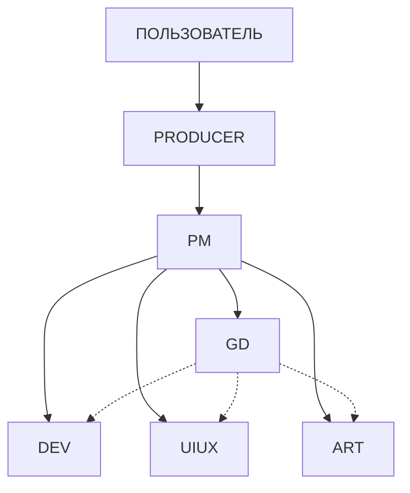

# GAMEDEVGD TEAM — AGENTS.md v2.0

**Проект:** GAMEDEVGD
**Версия:** 2.0
**Дата обновления:** 2026-03-04

---

## ⚠️ ЧИТАЕТСЯ ПЕРВЫМ ПРИ ЛЮБОМ ВХОДЕ АГЕНТА В ПРОЕКТ

---

## 🎯 Что это за проект

Мультиагентная команда разработки мобильных гиперказуальных игр на Unity.  
**6 агентов** в **6 отдельных Workspaces** Antigravity IDE работают в одном Unity-проекте,  
общаясь через файловую систему (`.gemini/antigravity/brain/`), без прямого вызова друг друга.

### Стек проекта

| Компонент | Версия |
| ----------- | -------- |
| **Unity** | 6 LTS (6000.3.9f1) + URP |
| **Платформы** | iOS + Android |
| **IDE** | Antigravity (VSCode + Agent Manager) |
| **MCP Server** | `com.gamelovers.mcp-unity@1.2.0` |
| **AI Агенты** | Qwen Code (DEV), Producer, PM, GD, UIUX, ART |

---

## 👥 Структура команды

| Workspace          | Роль            | Rule-файл                 | Точка входа               |
| :----------------- | :-------------- | :------------------------ | :------------------------ |
| PRODUCER-Workspace | **Game Producer** | `.agent/rules/06_PRODUCER.md` | ← v2.0 (ТОЧКА ВХОДА)      |
| PM-Workspace       | Project Manager | `.agent/rules/01_PM.md`   | ← v2.0 (GD-Aware)         |
| GD-Workspace       | Game Designer   | `.agent/rules/02_GD.md`   | ← v2.0 (Extended GDD)     |
| DEV-Workspace      | Unity Lead Dev  | `.agent/rules/03_DEV.md`  | ← v2.0 (GDD-Aware)        |
| UIUX-Workspace     | UI/UX Designer  | `.agent/rules/04_UIUX.md` | ← v2.0 (GDD Constraint)   |
| ART-Workspace      | Art Director    | `.agent/rules/05_ART.md`  | ← v2.0 (Asset Statuses)   |

---

## 🚀 Точка входа: PRODUCER

**Все новые проекты начинаются через PRODUCER-Workspace.**

Команда НЕ запускается без утверждённого **Producer Brief**.

### Алгоритм запуска нового проекта

1. **Пользователь → PRODUCER:** `/concept [описание игры]` ← **ТОЧКА ВХОДА**
2. **PRODUCER:** Анализ концепта, marketability, feasibility check
3. **PRODUCER:** Создание `docs/PRODUCER_BRIEF.md` + `docs/PROJECT_PIPELINE.md`
4. **PRODUCER → PM:** Передача брифа
5. **PM:** Создание задач в `task_board.md`, запуск Sprint 0
6. **GD:** Создание GDD v0.1 (только после GDD начинается разработка)

---

## 📋 Первые действия при входе в проект

1. **Определить свою роль** по активному Rule-файлу воркспейса
2. **Прочитать** `.gemini/antigravity/brain/project_context.md`
3. **Прочитать** `.gemini/antigravity/brain/task_board.md`
4. **Начать работу** согласно протоколам своей роли

---

## 🗺️ Иерархия и коммуникация



---

## 📡 Коммуникационная шина

Все агенты общаются через **`.gemini/antigravity/brain/`**:

| Файл                 | Владелец  | Описание                               |
| :------------------- | :-------- | :------------------------------------- |
| `project_context.md` | PM        | Контекст проекта, статус, дедлайны     |
| `task_board.md`      | PM        | Доска задач (TODO/IN_PROGRESS/DONE/BLOCKED) |
| `gdd_summary.md`     | GD        | Краткое GDD                            |
| `art_bible_summary.md` | ART       | Арт-стиль кратко                       |
| `asset_registry.md`  | ART/UIUX  | Реестр всех ассетов                    |
| `decisions_log.md`   | Все агенты | Лог решений (append-only)              |

**Артефакты и планы:** `.agent/artifacts/`
**Продюсерские документы:** `docs/`
**A2A артефакты:** `.agent/artifacts/GD_to_[ROLE]_[TASK-ID].md`

---

## ⚡ Ключевые команды

| Команда                   | Кто использует          | Что делает                     |
| :------------------------ | :---------------------- | :----------------------------- |
| `/concept [текст]`        | Пользователь → PRODUCER | Старт нового проекта           |
| `/report [AGENT]`         | PRODUCER                | Запрос отчёта у агента         |
| `/milestone [N]`          | PRODUCER                | Контрольная точка              |
| `/market [жанр]`          | PRODUCER                | Анализ рынка (Perplexity)      |
| `/sync`                   | PM                      | Ежедневная сводка              |
| `/done TASK-ID`           | Все агенты              | Задача выполнена               |
| `/handoff`                | Все агенты              | Сохранение контекста           |
| `/resume`                 | Все агенты              | Восстановление контекста       |
| `/asset-request [тип] [описание]` | Все агенты              | Запрос ассета у ART            |
| `/qwen-autonomous [TASK-ID]` | Qwen Code               | Автономный режим DEV           |
| `/feature-spec [название]` | GD                      | Написать feature spec + ТЗ     |
| `/balance-review`         | GD                      | Аудит экономики                |
| `/design-review [TASK-ID]` | GD                      | Ревью реализации на GDD        |
| `/liveops-plan [тип]`     | GD                      | Спроектировать LiveOps         |
| `/concept-gd`             | GD                      | Создать GDD v0.1               |

---

## 🆘 Экстренные контакты

| Ситуация                | Действие                                       |
| :---------------------- | :--------------------------------------------- |
| **Блокер**              | Эскалировать к PM через `task_board.md` (статус BLOCKED) |
| **Конфликт архитектурный** | `decisions_log.md` + уведомление PM + PRODUCER |
| **Pivot концепта**      | PRODUCER принимает решение                     |
| **Критический баг в прототипе** | DEV → PM → PRODUCER (если влияет на сроки) |

---

## 📋 PM — Project Manager v2.0

**Rule-файл:** `.agent/rules/01_PM.md`
**Версия:** 2.0 (GD-Aware) | Обновлено: 2026-03-04

### Ключевые изменения v2

- Backlog формируется ОТ GDD, не от идей PM
- Обязательный GD Gate для DESIGN задач перед DONE
- Работа с A2A артефактами GD (распределение, не пересказ)
- doc-extractor routing: входящие материалы → GD
- Метрика GDD coverage ≥ 90% как KPI спринта

### Слэш-команды

`/new-project` `/sync` `/done` `/sprint-plan` `/milestone-check` `/unblock`

### Что PM НЕ делает

- Не принимает дизайн-решения
- Не анализирует входящие документы (это GD)
- Не закрывает DESIGN задачи без GD Gate

---

## 🎮 GD — Game Designer Generalist

**Rule-файл:** `.agent/rules/02_GD.md`
**Workspace:** GD-Workspace (Claude 4.6 / 4.5 Extended Thinking)
**Владеет:** `docs/GDD/`, `brain/gdd_summary.md`
**Обновлено:** 2026-03-04

### Что делает

- Создаёт и актуализирует GDD (Single Source of Truth по дизайну)
- Пишет ТЗ для DEV/ART/UIUX/PM через A2A артефакты
- Проектирует Core Loop, мету, экономику, LiveOps события
- Проводит design-review реализованных фич
- Проводит balance-review экономики перед milestone

### Слэш-команды GD

| Команда             | Описание                                   |
| :------------------ | :----------------------------------------- |
| `/gdd-update`       | Обновить GDD, уведомить команду            |
| `/feature-spec [название]` | Написать feature spec + ТЗ агентам         |
| `/balance-review`   | Аудит экономики и прогрессии               |
| `/design-review [TASK-ID]` | Ревью реализации на соответствие GDD       |
| `/liveops-plan [тип]` | Спроектировать LiveOps событие             |
| `/concept-gd`       | Создать GDD v0.1 на основе Producer Brief |

### Skills (on-demand)

- `gdd-template` — мастер-шаблон GDD + reverse-engineering протокол
- `design-heuristics` — 9 Rules + 12 Tricks чек-лист
- `loops-and-arcs` — nested loops модель
- `mobile-design-checklist` — Unity mobile constraints
- `agent-tz-template` — шаблон ТЗ для агентов
- `hypercasual-patterns` — паттерны гиперказуальных игр
- `doc-extractor` — анализ входящих документов и схем

### Как взаимодействовать с GD

- **PM → GD:** создать задачу TASK-GD-XXX в `task_board.md`
- **DEV → GD:** завершить задачу, написать в GD-Workspace `/design-review TASK-XXX`
- **ART/UIUX → GD:** прочесть `brain/gdd_summary.md` секцию «For ART» / «For UIUX»
- **GD → все:** читать `.agent/artifacts/GD_to_[ROLE]_[TASK-ID].md`

### RBAC Summary

| Файл                 | Доступ            |
| :------------------- | :---------------- |
| `docs/GDD/`          | R/W (единственный владелец) |
| `brain/gdd_summary.md` | R/W (единственный владелец) |
| `brain/decisions_log.md` | Append-only       |
| `brain/task_board.md` | Read-only         |
| `Assets/_Project/`   | Read-only         |

---

## 🔧 MCP Unity интеграция

**Статус:** ✅ ПОДКЛЮЧЁН (порт 8090)

**Конфиг для Antigravity Settings:**

```json
{
  "mcpServers": {
    "unity": {
      "command": "node",
      "args": ["d:/ASTRA/My project/Library/PackageCache/com.gamelovers.mcp-unity@1.2.0/Server~/build/index.js"]
    }
  }
}
```

**Важно:** Unity Editor должен быть открыт для работы MCP сервера.

### Доступные MCP инструменты

- `get_scene_info` — информация о сцене
- `get_scenes_hierarchy` — иерархия объектов
- `get_gameobject` — детали GameObject
- `get_console_logs` — логи Unity Console
- `update_gameobject` — создать/обновить объект
- `update_component` — добавить/настроить компонент
- `execute_menu_item` — выполнить команду меню
- `load_scene` / `save_scene` / `create_scene` — управление сценами

---

## 📚 Дополнительные ресурсы

| Файл | Описание |
| --- | --- |
| [README.md](README.md) | Основная документация проекта |
| [docs/WIKI.md](docs/WIKI.md) | Полное руководство команды |
| [docs/TEAM_PIPELINE.md](docs/TEAM_PIPELINE.md) | Визуализация пайплайна |
| [.qwen/QWEN.md](.qwen/QWEN.md) | Контракт поведения Qwen Code |

---

## 📊 Текущий статус проекта

| Параметр | Значение |
| --- | --- |
| **Проект** | GAMEDEVGD v2.0 |
| **Статус** | 🟢 ГОТОВ К РАБОТЕ |
| **MCP Unity** | ✅ ПОДКЛЮЧЁН |
| **Следующий шаг** | Запустить `/concept` в PRODUCER-Workspace |

---

---

### Skill: doc-extractor

**Путь:** `.agent/skills/doc-extractor/SKILL.md`
**Использует:** GD (основной), PM, PRODUCER (read)
**Назначение:** Анализ входящих документов, изображений, ссылок →
структурированный Extraction Report → заполнение GDD / Feature Spec /
Balance Sheet / LiveOps Event.
**Активация:** автоматически при наличии вложений у пользователя.

---

**GAMEDEVGD Team © 2026**
